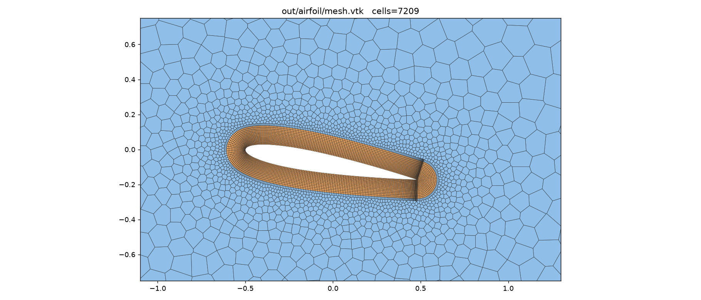
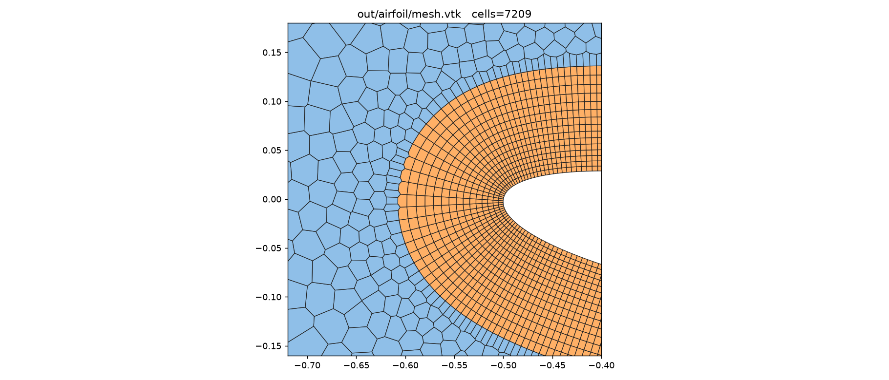
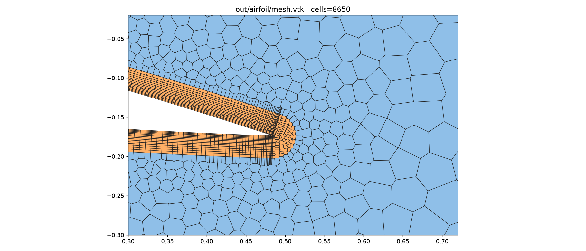
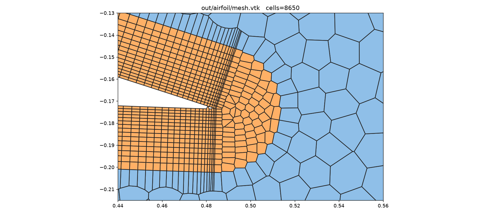
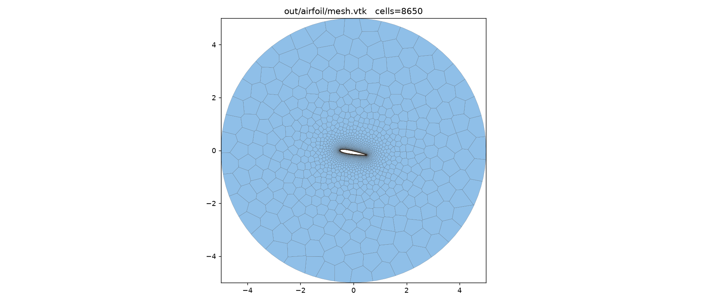
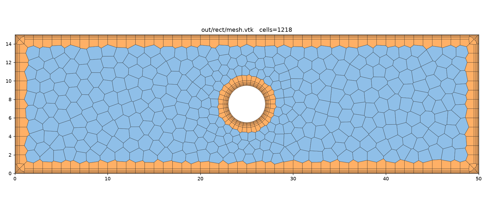

# poly2d — obecný 2D polygonální (polyhedral) mesher s prism vrstvami

Generátor 2D **polygonálních** sítí (Voronoi duál Delaunay triangulace) se
strukturovanou **prismatickou (mezní) vrstvou** u stěn. Je psaný obecně — doména
se popisuje orientovanými hraničními smyčkami, takže funguje na libovolné 2D
oblasti. Umí export do **VTK** (ParaView), **SVG** (rychlý náhled) a
**OpenFOAM 14** (`constant/polyMesh`).

Napsáno v **C++20**, bez externích závislostí (header-only knihovna v `include/`).

## Ukázkové případy

Program `poly2d` generuje dva případy (jádro mesheru je ale plně obecné):

| případ | doména | vnitřní těleso | prism |
|--------|--------|----------------|-------|
| `rect` | obdélník 50 × 15 cm | kruh ⌀ 4 cm ve středu | 5 vrstev na stěnách, 6 na válci |
| `airfoil` | kruh ⌀ 10 m | profil **NACA 0012**, tětiva 1 m, úhel náběhu **10°** | **15 vrstev** na profilu, 1. buňka **0,005 m**, growth 1,05 |

<p align="center"><i>rect: polygonální jádro + prism u všech stěn a válce &nbsp;•&nbsp;
airfoil: odstupňované jádro (jemné u profilu → hrubé u farfieldu) + mezní vrstva</i></p>

## Ukázky

**NACA 0012 v kruhovém farfieldu (úhel náběhu 10°)**



Pravidelné polyhedrální (honeycomb) jádro odstupňované k farfieldu, strukturovaná
mezní vrstva a spojitý přechod 1 prisma → 1 polyhedron.

| náběžná hrana | odtoková hrana | detail špičky TE |
|:---:|:---:|:---:|
|  |  |  |

Mezní vrstva **obtáčí ostrou odtokovou hranu** soustřednými dráhami (zaoblení
konvexního vrcholu vějířem oblouků).

Celá doména (⌀ 10 m):



**Obdélníkový kanál 50 × 15 cm s válcem ⌀ 4 cm**



## Sestavení a spuštění

```bash
cmake -S . -B build -DCMAKE_BUILD_TYPE=Release
cmake --build build -j
./build/poly2d both        # nebo: rect | airfoil
```

Výstupy se zapíší do `out/<case>/`:

```
out/rect/mesh.vtk                 # polygonální síť pro ParaView
out/rect/mesh.svg                 # náhled bez ParaView
out/rect/constant/polyMesh/       # OpenFOAM síť (points, faces, owner, neighbour, boundary)
```

## Jak to funguje

1. **Jádro (Poisson-disk).** Odstupňované rozmístění jader řízené *size field*
   funkcí `h(x)` (Bridsonův algoritmus). Tím lze mít u profilu jemné buňky a u
   vzdáleného farfieldu hrubé, bez explozivního počtu buněk.
2. **Prism vrstvy.** Kolem každé smyčky, která si vyžádá `PrismSpec`, se vytvoří
   strukturované prstence jader odsazené po vnitřní normále s geometrickým růstem
   (`firstHeight`, `growth`, `nLayers`).
3. **Konformita s hranicí (mirror seeds).** Příhraniční jádra se zrcadlí přes
   stěnu; Voronoi hrany pak leží přesně na hranici. Rohy se ošetří dvojitým
   zrcadlením.
4. **Voronoi.** Buňky jsou duálem Delaunay triangulace (Bowyer–Watson); vrcholy
   Voronoi buněk jsou opsané kružnice trojúhelníků → sdílené hrany jsou přesné.
5. **Lloydova relaxace** (volitelně, `Options::lloydIters`). Jádrová jádra se
   několikrát posunou do těžiště své Voronoi buňky → pravidelné, zaoblené
   polygony (šestiúhelníkový „honeycomb" jako v komerčních řešičích). Prism
   jádra zůstávají pevná, takže mezní vrstva zůstane strukturovaná.
6. **Úklid.** Hraniční uzly se promítnou na stěnu, splynulé uzly se svaří a
   degenerované buňky se zahodí — výsledek je vodotěsný.

**Přechod prism → polyhedra.** Aby na každý prism sloupec navazoval jeden
polyhedron (a rozhraní bylo spojité bez zubů), drží size field velikost jádra
rovnou tangenciálnímu kroku prism vrstvy až k jejímu čelu a odstupňovává se až
za ním. Volitelně (`Options::transitionRing`) lze vložit prstenec polygonů
zarovnaný přesně 1:1 s prism sloupci.

## Export do OpenFOAM 14

OpenFOAM nemá nativní 2D síť; 2D úloha je síť **jednu buňku tlustá** ve směru `z`,
jejíž přední a zadní stěny tvoří patch typu `empty`. `FoamWriter` proto 2D síť
extruduje:

* každá 2D buňka → 3D polyedrická buňka,
* každá vnitřní 2D hrana → vnitřní `quad` stěna (owner < neighbour),
* každá hraniční 2D hrana → hraniční stěna s pojmenovaným patchem,
* `z = 0` a `z = tl.` → dvě stěny na patchi `frontAndBack` (`empty`).

Orientace stěn (normála owner→neighbour, resp. ven z domény) se určuje z navinutí
2D buňky, takže `checkMesh` hlásí uzavřené buňky (ověřeno,
`max |Σ ploch| ≈ 1e-16`).

Použití v OpenFOAM (síť je už v metrech — `rect` se škáluje z cm):

```bash
cp -r out/airfoil/constant/polyMesh  $FOAM_CASE/constant/
checkMesh
```

Patche pro `airfoil`: `farfield` (patch), `airfoil` (wall), `frontAndBack` (empty).
Patche pro `rect`: `inlet`, `outlet` (patch), `top`, `bottom`, `cylinder` (wall),
`frontAndBack` (empty). Typ patche lze změnit přes `FoamOptions::patchType`.

**Hotový OpenFOAM case** pro profil je v `cases/airfoil/` (ustálené nestlačitelné
RANS, k‑ω SST, `foamRun`/`incompressibleFluid`, OpenFOAM v11+/14). Spuštění:

```bash
cd cases/airfoil && ./Allrun    # sestaví mesher, vygeneruje a naimportuje síť, spustí solver
```

## Vlastní doména

```cpp
poly2d::Domain dom;
dom.addRectangle(0,0, 2,1, "inlet","outlet","bottom","top", /*hBnd*/0.05,
                 poly2d::PrismSpec{8, 0.002, 1.2});
dom.addCircle({0.5,0.5}, 0.1, "cyl", 0.02, /*hole*/true,
              poly2d::PrismSpec{10, 0.001, 1.2});
dom.build();

poly2d::Mesher::Options opt;
opt.sizeField = [](poly2d::Vec2){ return 0.05; };   // konstantní nebo odstupňované
auto mesh = poly2d::Mesher(dom, opt).generate();
```

Libovolný uzavřený obrys jde přidat přes `dom.addPolyLoop(points, "patch", hole, hBnd, prism)`.

## Kontrola sítě

```bash
python3 scripts/check_polymesh.py out/airfoil/constant/polyMesh   # validace polyMeshe
python3 scripts/plot_mesh.py out/airfoil/mesh.vtk preview.png     # PNG náhled (matplotlib)
```

## Poznámky / omezení

* Delaunay je jednoduchý `O(n²)` Bowyer–Watson — dostatečný pro řádově tisíce až
  desetitisíce jader. Pro velmi jemné sítě by chtěl prostorové vyhledávání.
* Profil má **ostrou odtokovou hranu** a prism vrstva ji obtéká **spojitě**
  dokola (vrstvy se u TE sbíhají a pokračují do úplavu). Prism tangenciální
  krok je sladěný s velikostí jádra u profilu, takže přechod prism→polygony je
  plynulý bez zubů. Alternativně lze zapnout **tenkou tupou TE** přes
  `naca0012(..., sharpTE=false)` a vynechat prism na TE základně přes
  `Loop::prismSkip` (úplav pak vyplní polygonální jádro).
* `size field`, počet a růst vrstev, tloušťka extruze i škála jsou parametry v
  `src/main.cpp`.
